> Простите, во второй части работы не тот цвет диода. Больше не повториться, в следующий раз буду внимательнее =/
## Cхема макетка 5 вольт

### Работа схемы:
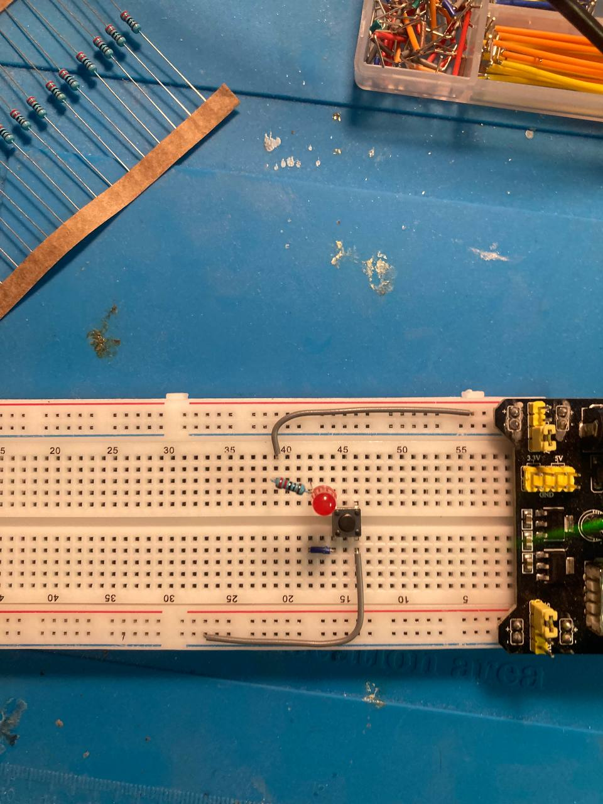
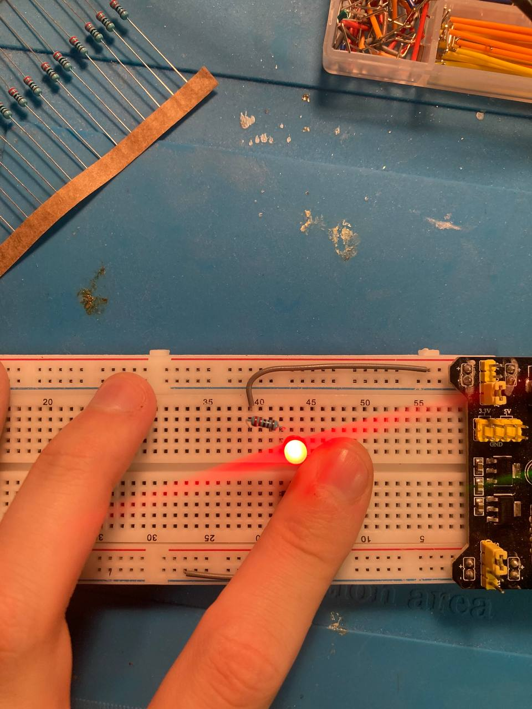

### Измерения (ток, напряжение):
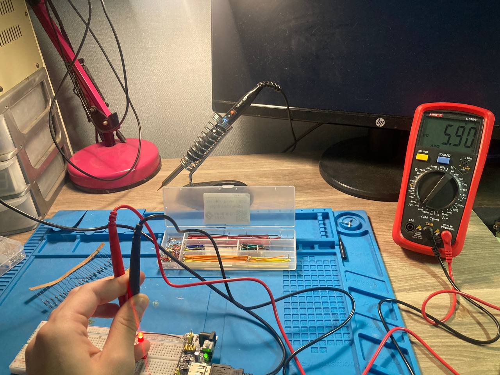
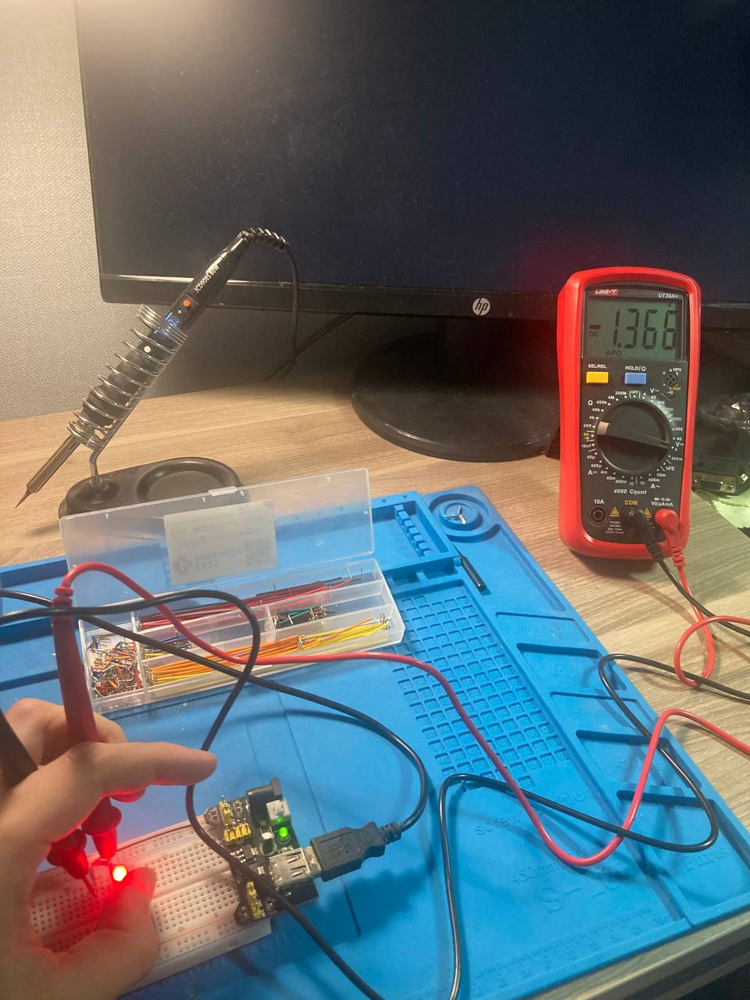

## Cхема макетка 12 вольт

### Работа схемы:

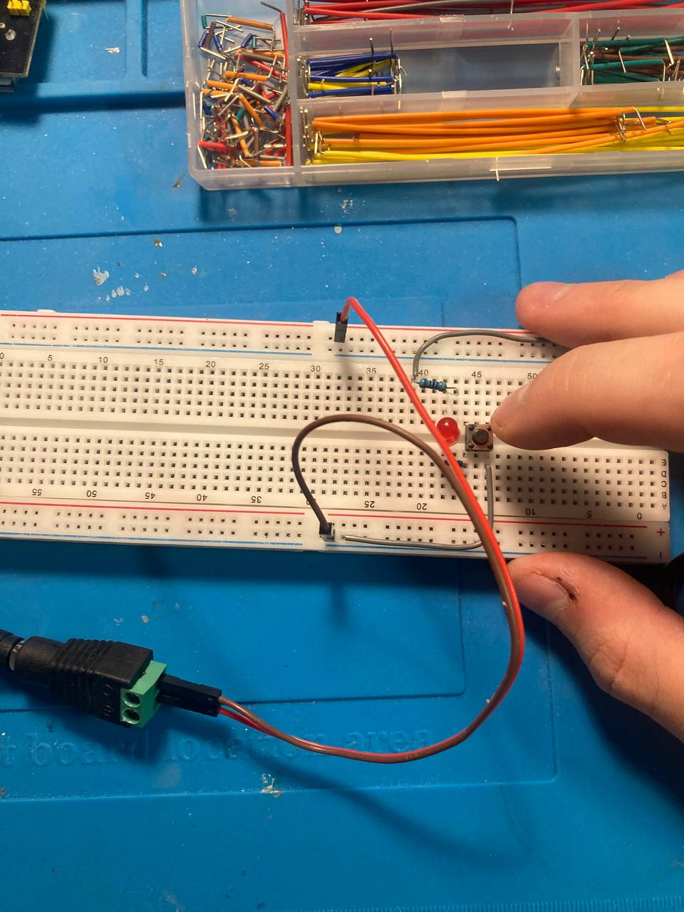
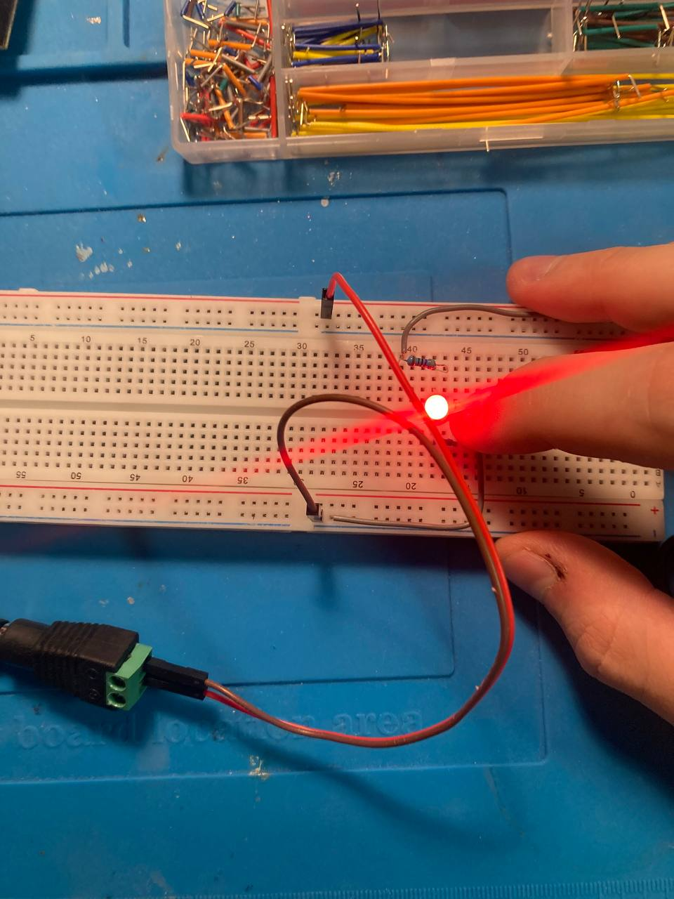

### Измерения (ток, напряжение):

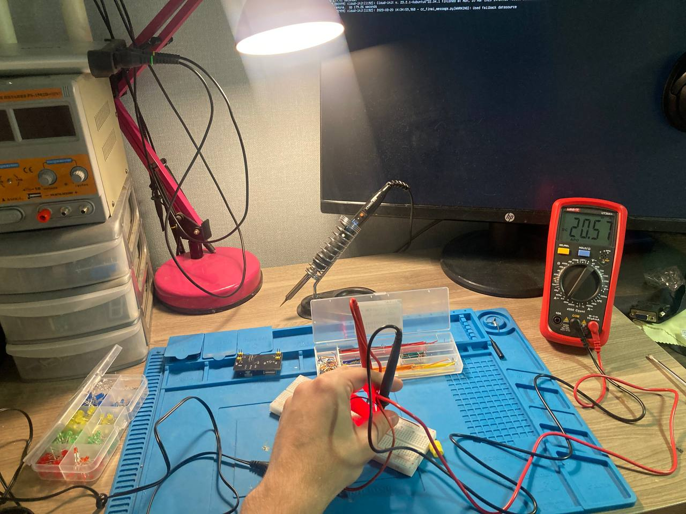
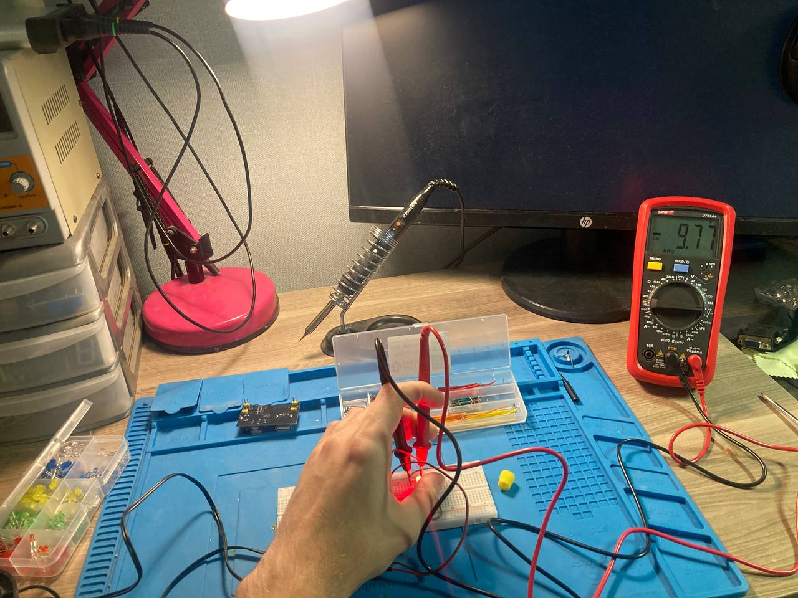

## Cхема монтаж пайкой

### Работа схемы:
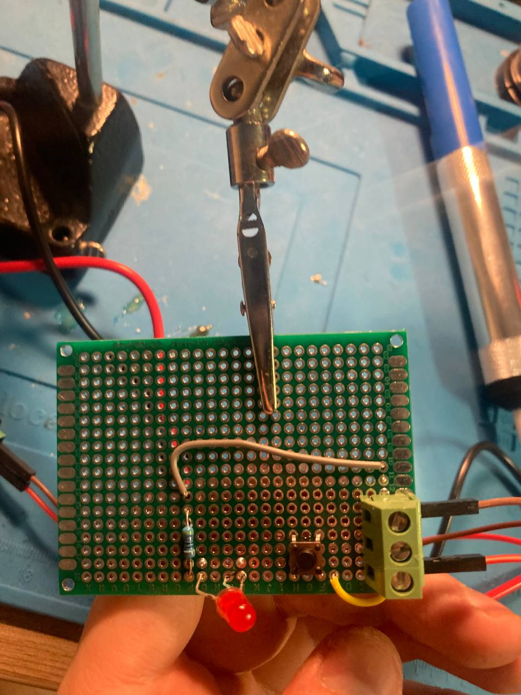
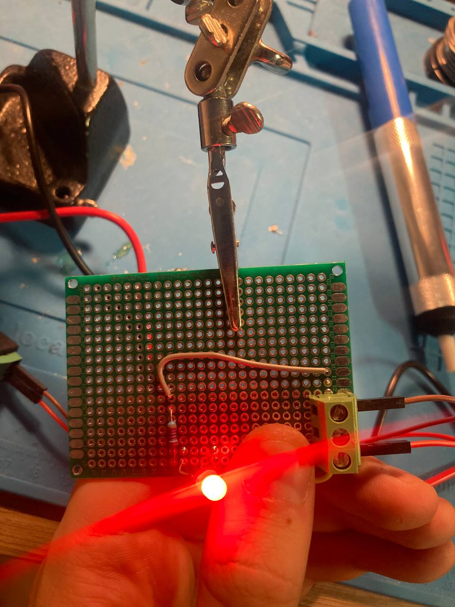

### Зачищенная схема:
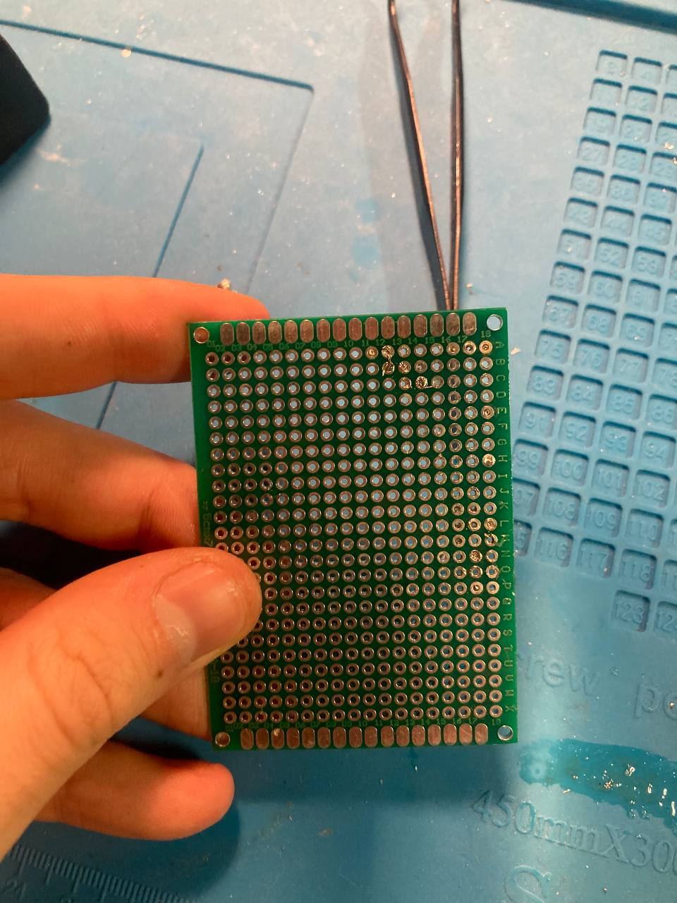