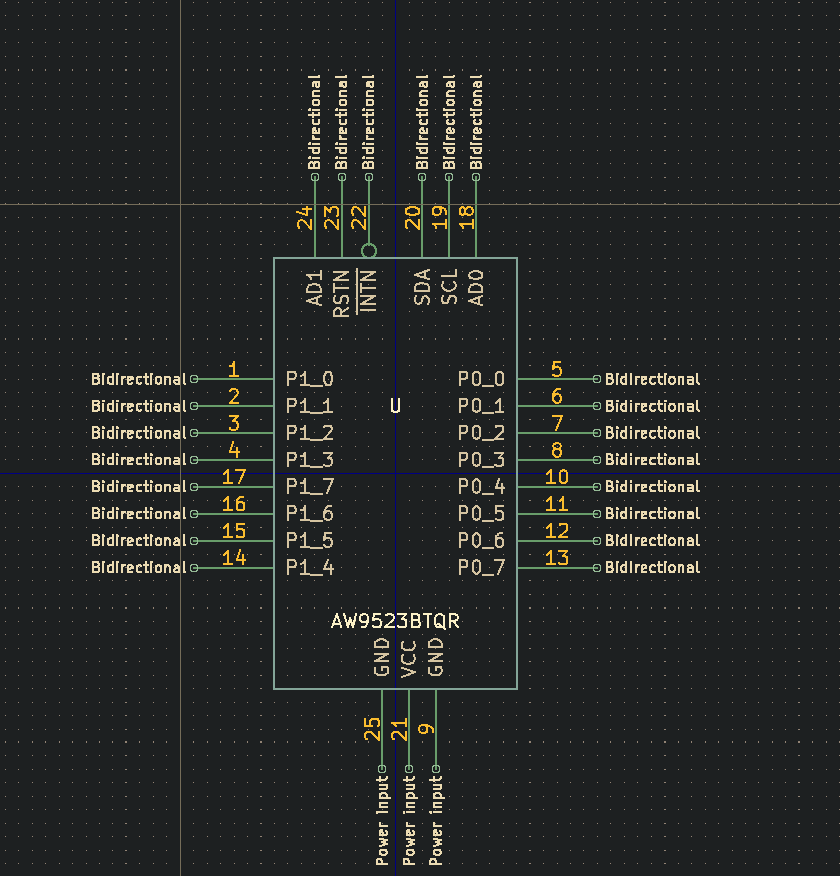
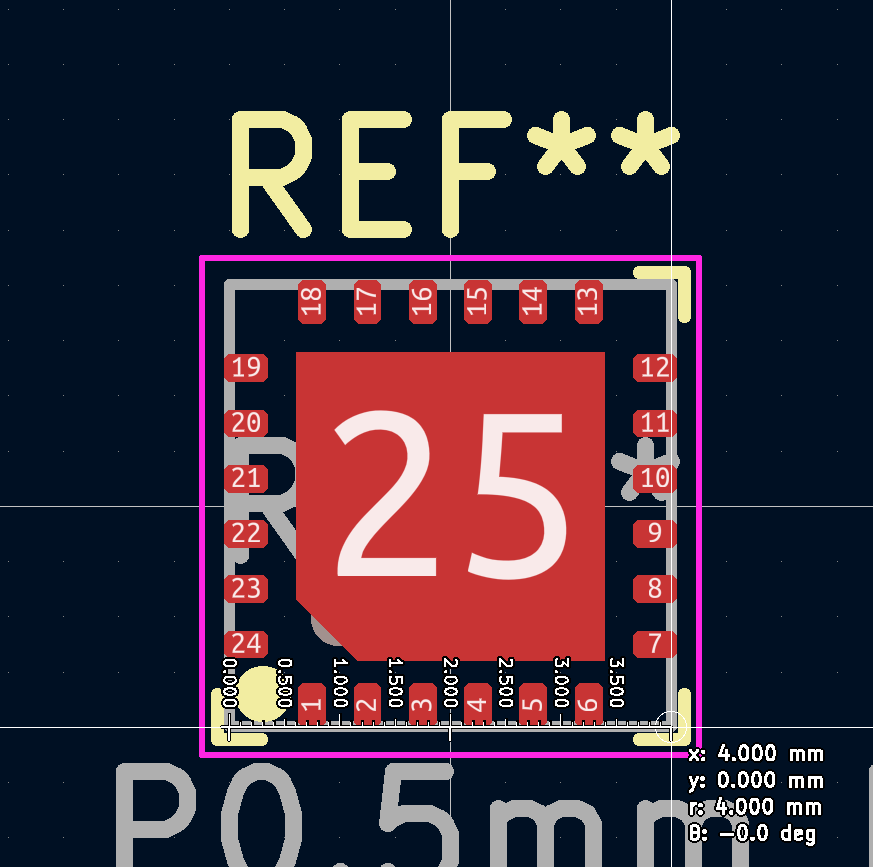
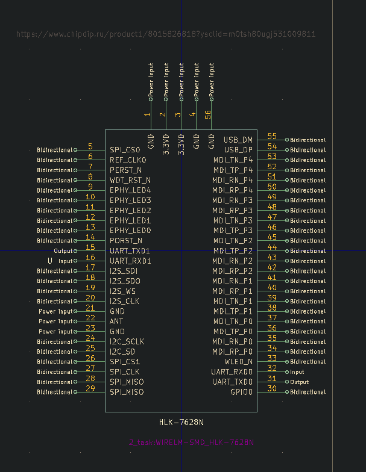
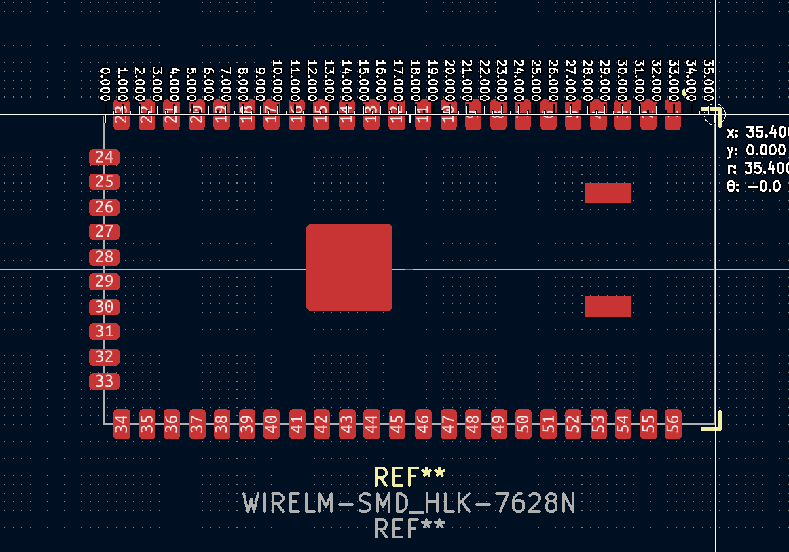
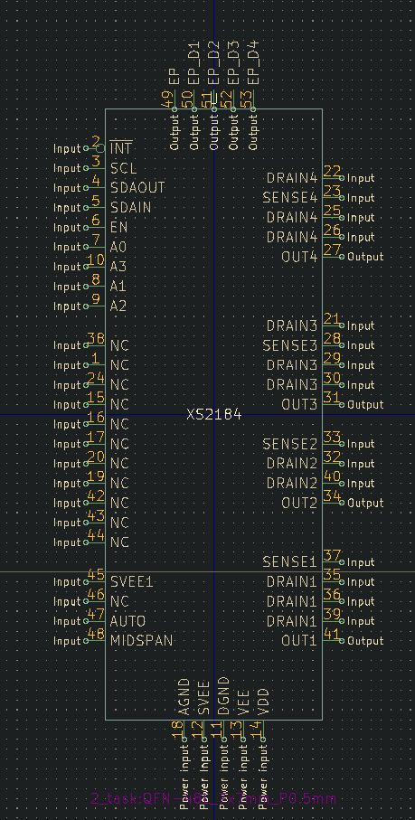
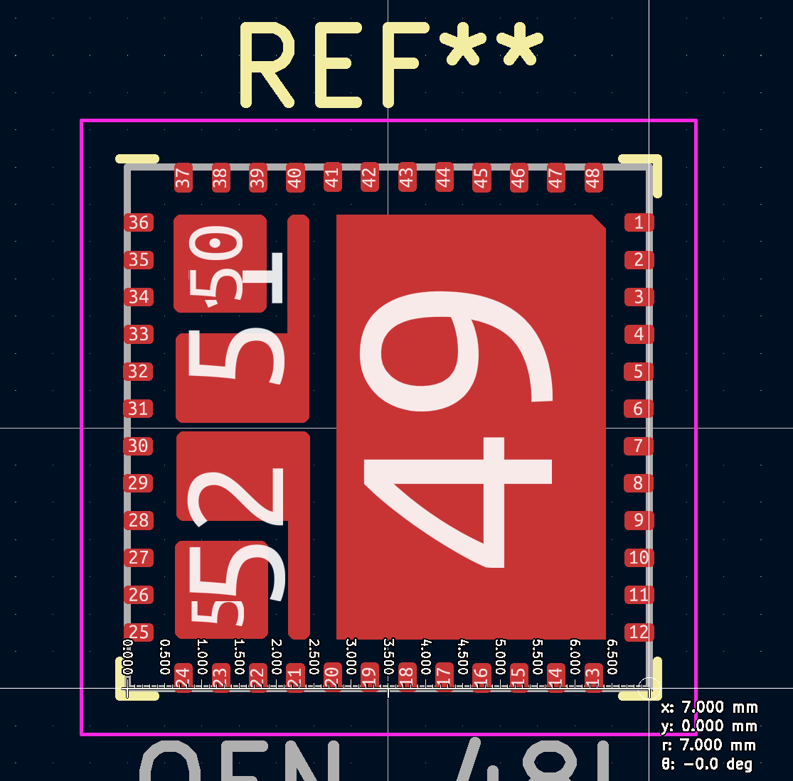
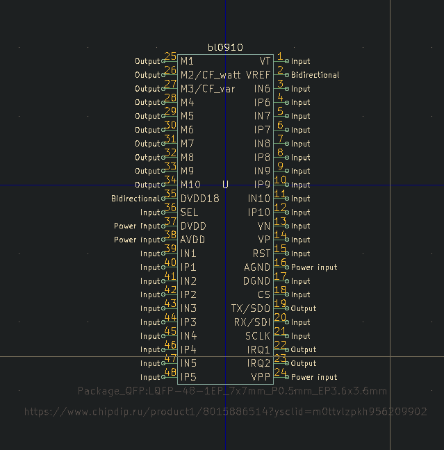

**Волков Е.А.**

# Разработка символов для компонентов

## AW9523BTQR

### Символ:

### Футпринт:

## HLK-7628N

### Символ:

### Футпринт:

## XS2184

### Символ:

### Футпринт:

## bl0910

### Символ:

### Футпринт:

Взят из стандартной библиотеки