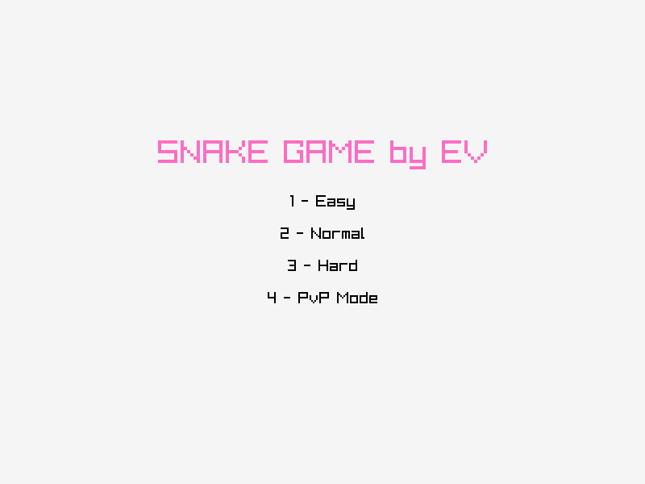
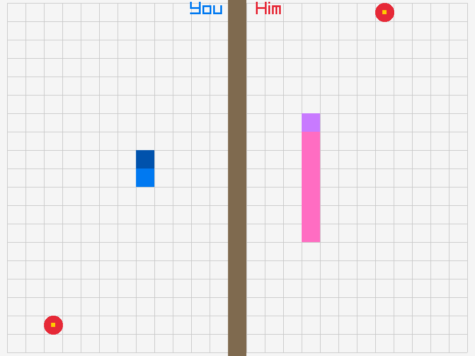
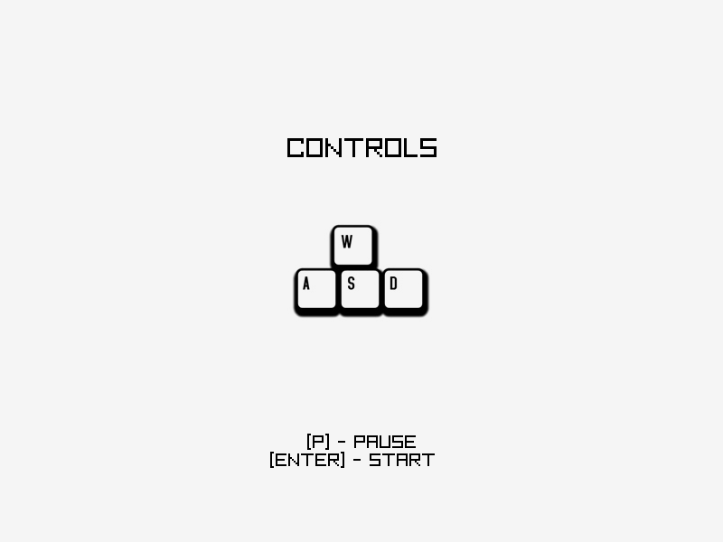
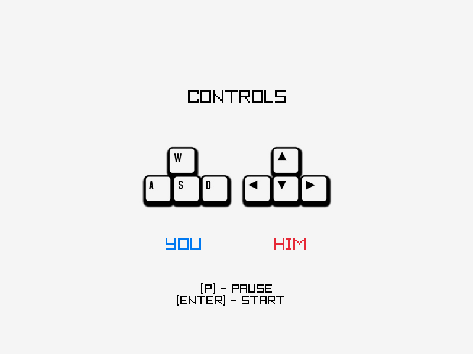

# Snake Game by EV




Этот проект представляет собой простую игру «Змейка», использующую библиотеку Raylib, с возможностью кооперативной игры.

## Режимы игры
- **Easy** Простой режим, для ознакомления и привыкания к управлению;
- **Normal** Основной режим, для привыкнувших к управлению;
- **Hard** Для отчаянных;
- **PvP Mode** Для кооперативной игры.

## Управление

- Одиночная игра:


- Кооперативная игра:



## Структура проекта

```bash
├── build
│   ├── README.md
│   └── snake_game
├── inc
│   ├── raylib.h
│   ├── raymath.h
│   └── rlgl.h
├── lib
│   ├── lib_unix
│   │   └── libraylib.a
│   └── lib_win
│       ├── x64
│       │   └── libraylib.a
│       └── x86
│           └── libraylib.a
├── Makefile
├── README.md
├── res
│   ├── img
│   │   ├── controls.png
│   │   ├── controls_pvp.png
│   │   ├── controls_solo.png
│   │   ├── menu.png
│   │   └── pvp.png
│   └── sound
│       └── ping.wav
└── src
    └── main.c
```

## Требования

**Linux**
- GCC(**!!x64!!**)
- make

**Windows**
- MinGW(64/32)
- make

## Установка
Склонируйте репозиторий:

```bash
git clone https://github.com/gole00201/DPO_MFTI.git
```

Перейдите в папку проекта:

```bash
cd ./DPO_MFTI/snake
```

## Компиляция и запуск
### Linux

Компиляция:

```bash
make ARCH=unix
```
Запуск:

```bash
./build/snake_game
```
### Windows

Компиляция:

```bash
make ARCH=win64
```

```bash
make ARCH=win86
```
Запуск:
``` bash
build\snake_game.exe
```

## Зависимости

**[Raylib 5.0](https://www.raylib.com/)**

